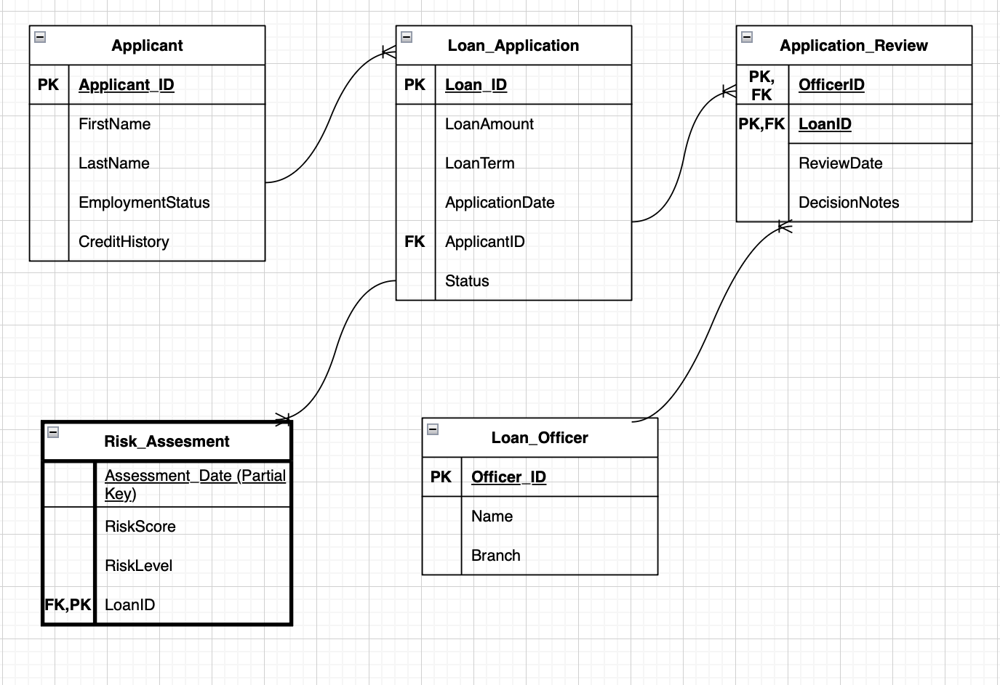

#Banking Loan Approval & Risk Database

#Create a banking database analyzing loan applications, approvals, and risk factors.

##Application Domain

The application domain for this project is banking and financial services, with a focus on loan application processing and credit risk assessment. The database models how banks gather application data, assess financial risk factors, and decide whether to approve or refuse loans based on predetermined business criteria.

##Intended Users

-Bank Administrators -Loan Officers -Risk Analyst

##High-Level Goals

-Maintain and store applicant financial information and loan applications in a relational database. -Examine loan approvals and rejections according to applicant risk factors. -Utilize stored procedures to determine applicant risk scores.
-Support analytical queries to find patterns in risk levels and loan approvals

##Data Source

The selected dataset is a Loan Prediction Problem Dataset, which This includes information about past loan applications, including applicant and co-applicant income, loan amount, credit history, employment and marital status, property area, and loan approval decisions.

##Part B: E/R Diagram

This project uses a relationial database application that manages bank loan applications, approvals, and risk assessments. The system models how financial istutions collect application information, evaluate risks, and make loan approval desciions. This database stores loan and pplicant data. It also assigns loan officers to review the application.It calculates risks and enforces approval rules. This type of design emphasizes normalization, integrity, and is an accurate model of real-worl loan proccessing operations.

##Final ER Design



## How to Use This Repo
Follow these steps to set up the database and run the application on your local machine.

### Step 1: Database Initialization
Open your SQL environment and run the `create_db.sql` script. This will create the necessary tables and relationships.
* **File:** `create_db.sql`

### Step 2: Populate the Database
Run the `dataload.py` script to populate your new tables with the initial "toy" dataset.
```bash
python dataload.py

```

### Step 3: Run the Application
Launch the terminal-based interface by running:
```bash
python3 app.py
```
